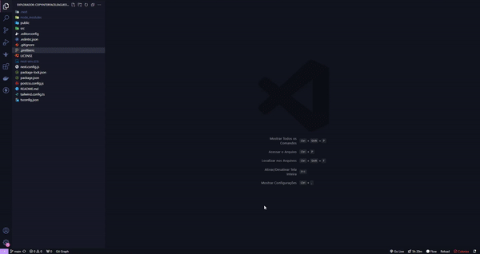

# Learning Tailwind Css

Meu aprendizado com javascript na Udemy

✓ Working With Tailwind Css!  
✓ Working With NextJs 13!  

 <h1>✅Project</h1>
 <h3>📚  Funcionamento</h3>

 <h6 align="center">
    
 </h6>
 <h2></h2>

 <h3>📚  Código</h3>

 <h6 align="center">
    
 </h6>
